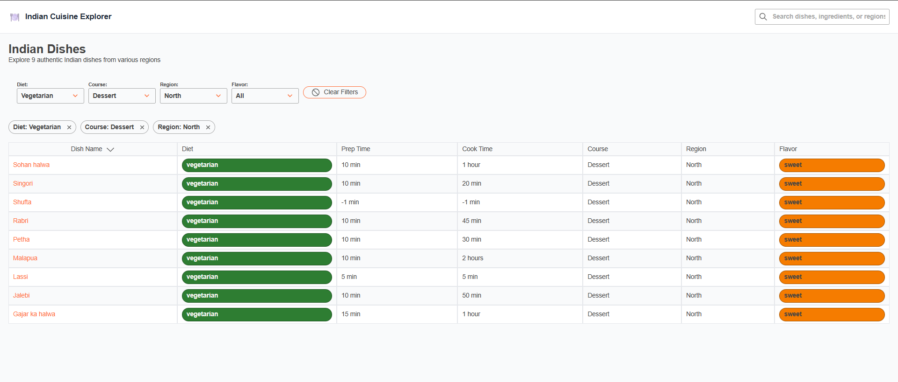
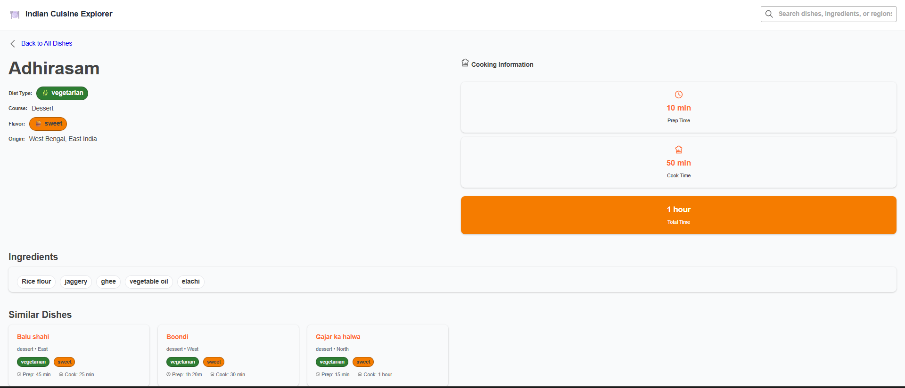

# Indian Food Frontend

A Node.js Express frontend for Indian food data, supporting CRUD operations, ingredient-based dish suggestions, and CSV/JSON data management.

 ## Dish Details
 - Displays the following attributes of a given dish:
 - 1. name
 - 2. ingredients
 - 3. diet type (veg or non-veg)
 - 4. preparation time
 - 5. cooking time
 - 6. flavor
 - 7. course
 - 8. state
 - 9. region

 ## Dishes List
 - List all the dishes and their details in a tabular format.
 - 1. Use pagination to limit the number of rows displayed at a time.
 - 2. Enable sorting on a few relevant columns such as dish name, prep time, cooking time, etc.
 - 3. Enable filtering on a few relevant columns such as diet, flavor, state, etc.
 - 4. Navigation:
   - a. Display "Dish Details" upon clicking the dish name in the table




## Project Structure

```
indian-food-frontend/
  src/
    Components              # Components
    Pages                   # Pages
    Pages/
      DisDetails
      HomePage
      NotFoundPage
    
    utils                   # api gateways and functions
    App.css
    App.jsx
    App.test.js
    index.css
    index.js
    logo.svg
    reportWebVitals
    setupTests
    theme
  package-lock.json
  package.json
  README.md

 .gitignore

```

## Getting Started

### Prerequisites

- Node.js (v18+ recommended)
- npm

### Installation

1. Clone the repository:
   ```sh
   git clone <https://github.com/imosama001/indian-food.git>
   cd indian-food-frontend
   ```
2. Install dependencies:
   ```sh
   npm install
   ```

### Running the Server

Start the frontend server:

```sh
npm start
```

The server will run on [http://localhost:3000](http://localhost:3000) by default.


### Scripts

- `npm start` — Start the server with nodemon

## License

ISC

---

_For the backedn, see the `indian-food-backedn` folder._
